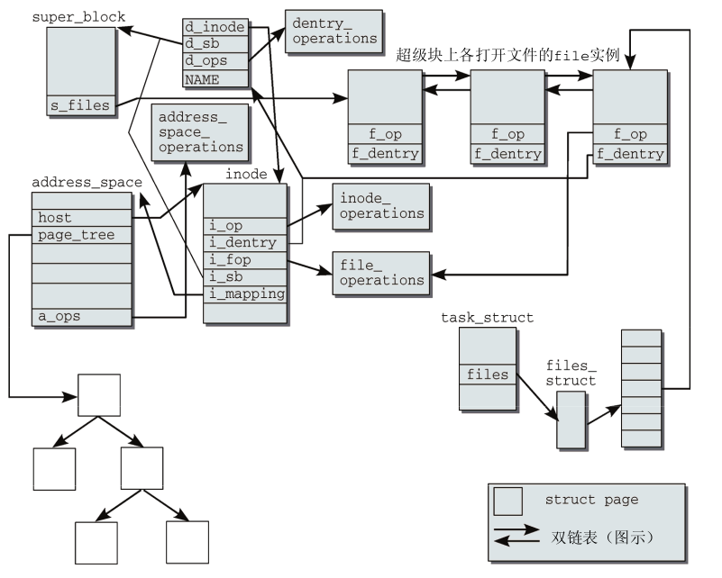

# 万物皆文件
* ext4, FAT, proc, net
* 块设备、字符设备、管道、套接字、终端
* VFS虚拟文件系统是一个通用模型，但它并不是所有文件的基类，相反可以看作是所有文件的超集，也即对于某一种具体文件系统，VFS的每个成员并不是都有具体含义。

# inode
* inode是OS对于“文件”的视图。每个文件/目录对应一个独一无二的inode结构体，包含此文件的文件状态和文件内容地址。
* 对于层级的文件目录，inode也表现的像一颗树。
* 软链接vs硬链接：软链接中每个符号都使用了一个inode，而硬链接中两个符号共享同一个inode。
* inode对应一个计数器，当计数器为0时，才可以完全删除。

# VFS结构

inode包含了文件节点的模式、大小等元数据信息，包含i_op(inode操作函数)和i_fop(文件操作函数)，包含lru链表指针。
```c
struct inode {
    //权限
	umode_t			i_mode;
	unsigned short		i_opflags;
	kuid_t			i_uid;
	kgid_t			i_gid;
	unsigned int		i_flags;
    //inode操作
	const struct inode_operations	*i_op;
    //super block
	struct super_block	*i_sb;
    //address_space,保存inode<=>file对应关系
	struct address_space	*i_mapping;
    //i_lru将同种状态的inode保存在一个链表上
    //基本有未被使用、使用、脏三种状态
	struct list_head	i_lru;		/* inode LRU list */
    //super block也保存这inode的链表
	struct list_head	i_sb_list;
	const struct file_operations	*i_fop;	/* former ->i_op->default_file_ops */
	struct file_lock_context	*i_flctx;
	struct address_space	i_data;
	struct list_head	i_devices;
	union {
		struct pipe_inode_info	*i_pipe;
		struct block_device	*i_bdev;
		struct cdev		*i_cdev;
		char			*i_link;
	};
	void			*i_private; /* fs or device private pointer */
};
```
inode_operations包含创建链接、文件重命名等操作；file_operations包含文件内容的读取、写入等操作。
```c
struct inode_operations {
	int (*create) (struct inode *,struct dentry *, umode_t, bool);
	int (*link) (struct dentry *,struct inode *,struct dentry *);
	int (*unlink) (struct inode *,struct dentry *);
	int (*symlink) (struct inode *,struct dentry *,const char *);
	int (*mkdir) (struct inode *,struct dentry *,umode_t);
	int (*rmdir) (struct inode *,struct dentry *);
	int (*mknod) (struct inode *,struct dentry *,umode_t,dev_t);
	int (*rename) (struct inode *, struct dentry *,
			struct inode *, struct dentry *);
} ____cacheline_aligned;
struct file_operations {
	struct module *owner;
	loff_t (*llseek) (struct file *, loff_t, int);
	ssize_t (*read) (struct file *, char __user *, size_t, loff_t *);
	ssize_t (*write) (struct file *, const char __user *, size_t, loff_t *);
	int (*mmap) (struct file *, struct vm_area_struct *);
	int (*open) (struct inode *, struct file *);
};
```
进程task_struct中包含文件系统的引用和信息。
```c
struct task_struct {
/* filesystem information */
//struct fs_struct {struct dentry *pwd; struct vfsmount *pwdmnt;}
	struct fs_struct *fs;
/* open file information */
//提供文件打开和关闭位图，提供下一次打开文件的fd
	struct files_struct *files;
};

struct file {
    //文件路径{struct vfsmount* mnt; struct dentry* dentry;}
	struct path		f_path;
	struct inode		*f_inode;	/* cached value */
    //文件操作函数
	const struct file_operations	*f_op;
	spinlock_t		f_lock;
	atomic_long_t		f_count;
	unsigned int 		f_flags;
	fmode_t			f_mode;
	loff_t			f_pos;
	struct fown_struct	f_owner;
	void			*private_data;

	struct address_space	*f_mapping;//指向inode地址空间映射，inode->i_mapping
} __attribute__((aligned(4)));	/* lest something weird decides that 2 is OK */
```
dentry目录项缓存用来快速找到与文件名相关的inode，然而dentry中只保存一部分文件系统。
```c
struct dentry {
	/* RCU lookup touched fields */
	unsigned int d_flags;		/* protected by d_lock */
	seqcount_t d_seq;		/* per dentry seqlock */
	struct hlist_bl_node d_hash;	/* lookup hash list */
	struct dentry *d_parent;	/* parent directory */
	struct qstr d_name;
	struct inode *d_inode;		/* Where the name belongs to - NULL is
					 * negative */
	unsigned char d_iname[DNAME_INLINE_LEN];	/* small names */

	/* Ref lookup also touches following */
	struct lockref d_lockref;	/* per-dentry lock and refcount */
	const struct dentry_operations *d_op;
	struct super_block *d_sb;	/* The root of the dentry tree */
	unsigned long d_time;		/* used by d_revalidate */
	void *d_fsdata;			/* fs-specific data */

	struct list_head d_lru;		/* LRU list */
	struct list_head d_child;	/* child of parent list */
	struct list_head d_subdirs;	/* our children */
	/*
	 * d_alias and d_rcu can share memory
	 */
	union {
		struct hlist_node d_alias;	/* inode alias list */
	 	struct rcu_head d_rcu;
	} d_u;
};
```

## 注册文件系统
```c
struct file_system_type {
    const char * name;
    int fs_flags;
	struct dentry *(*mount) (struct file_system_type *, int,
		       const char *, void *);
	void (*kill_sb) (struct super_block *);
}
```
## 超级块
```c
struct super_block {
	struct list_head	s_list;		/* Keep this first */
	dev_t			s_dev;		/* search index; _not_ kdev_t */
	unsigned char		s_blocksize_bits;
	unsigned long		s_blocksize;
	loff_t			s_maxbytes;	/* Max file size */
	struct file_system_type	*s_type;
}
struct super_operations {
   	struct inode *(*alloc_inode)(struct super_block *sb);
	void (*destroy_inode)(struct inode *);

   	void (*dirty_inode) (struct inode *, int flags);
	int (*write_inode) (struct inode *, struct writeback_control *wbc);
	int (*drop_inode) (struct inode *);
	void (*evict_inode) (struct inode *);
}
```

## 装载和卸载
```c
struct vfsmount {
	struct dentry *mnt_root;	/* root of the mounted tree */
	struct super_block *mnt_sb;	/* pointer to superblock */
	int mnt_flags;
};
```

## 文件系统常用操作
### 查找inode
### 打开文件
### 读取和写入


